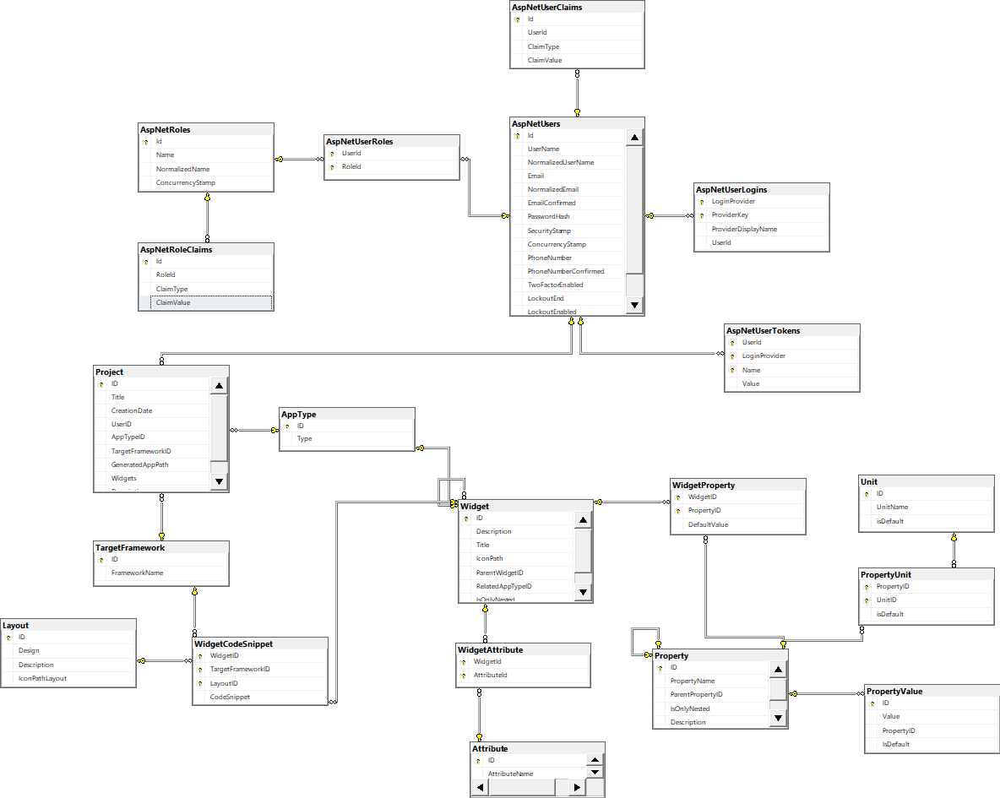
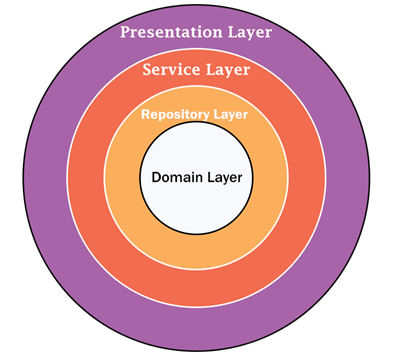

# Noob-Developer-API
A low-code no-code web API for building full web applications

## Table of contents

- [Noob-Developer-API](#noob-developer-api)
  - [Table of contents](#table-of-contents)
  - [Overview](#overview)
    - [Introduction](#introduction)
    - [Run The project](#run-the-project)
  - [Database Structure](#database-structure)
  - [Onion Architecture](#onion-architecture)
    - [Domain Layer](#domain-layer)
    - [Repository Layer](#repository-layer)
    - [Service Layer](#service-layer)
    - [Presentation Layer](#presentation-layer)
    - [ViewModel Layer](#viewmodel-layer)
  - [API Documentation](#api-documentation)
  - [JSON Structure](#json-structure)
    - [Description](#description)
    - [Example](#example)
  - [Contributors ](#contributors-)
  - [License ](#license-)

## Overview

### Introduction

ITWORX WebTool is a no /low code opensource platform for Easy and Fast development where the user can make his own application with no need of a strong coding background. the user can design it by draging and droping the different widgets. <br>

> **User Feature**

- Drag and drop customised widgets
- Registeration and login with email and full verification
- Reseting Account password by your mail
- Download your project as HTML, CSS and Js code folder
- Edit your old projects at any time
- Exisiting page tempelates for different usage

### Run The project

You need to install ASP 6 Core, VS 2022 and SSMS on your computer.

- [Download ASP 6](https://dotnet.microsoft.com/en-us/download/dotnet/6.0)
- [Download VS Studio](https://visualstudio.microsoft.com/vs/)
- [Download SSMS](https://docs.microsoft.com/en-us/sql/ssms/download-sql-server-management-studio-ssms?view=sql-server-ver16)

1 - You need to Configure your Database connection string

- WebTool/appsetting.json

```shell
"DefaultConnection": "Data Source=YOURDATASOURCE"
```

2- Start API

```shell
cd WebTool
dotnet run
```

## Database Structure

<p align="center">
 
</p>

## Onion Architecture

<p align="center">
 
</p>

### Domain Layer

This layer lies in the center of the architecture where we have application basic entities which are the application model classes or database model classes. <br>
In this layer, we followed Code First technique for domain layer creation.

### Repository Layer

The repository layer act as a middle layer between the service layer and model objects.This contain data access pattern for reading and writing operations with the database/ domain layer.<br>
We followed generic repository technique for this project

### Service Layer

This layer is used to communicate with the presentation and repository layer. The service layer holds all the business logic of the each entity.In this layer services interfaces are kept separate from their implementation for loose coupling and separation of concerns.

### Presentation Layer

Presentation layer can be connected to our UI applcoation.<br>
[For more information](https://github.com/Abd-ELrahmanHamza/Nope-developer)

### ViewModel Layer

Layer represent request or response body sent or recieved to presentation layer

## API Documentation

All details about each endpoints can be 
[Found Here](https://htmlpreview.github.io/?https://github.com/Ahmedsabry11/Nope-Developer-API/blob/main/documentation.html)

## JSON Structure

The data structure in which widgets & generated code are stored with


```js
{
 name: "Element name",
 text: "text"
 children: [
  Child widget 1,
  Child widget 2,
  ...
  ],
 style:{
    property1:value1,
    property2:value2
 }
 attributes: {
    attribute1:value1,
    attribute2:value2
    }
}
```

### Description

1. name
    - Type: String
    - It is the name of HTML element like: p, div, span,...
2. text
    - Type: String
    - The text inside element(if exist)
3. children
    - Type: Array of Objects (JSON)
    - Array of JSON structures for children of the element
4. style
    - Type: Object (JSON)
    - The style of element: the key is the **property name** and the value is the **property value**
4. attributes
    - Type: Object (JSON)
    - The attributes of element: the key is the **attribute name** and the value is the **attribute value**

### Example

```HTML
<div id="div-1" style="color:red">
    <p>
        This is text
    </p>
    <span>
        Text in span
    </span>
</div>
```

```js
{
    name:"div",
    text:"",
    children:[
      {
        name:"p",
        text:"This is text",
        children:[],
        style:{}
        attributes:{}
      },
      {
        name:"span",
        text:"Text in span",
        children:[],
        style:{}
        attributes:{}
      }
    ],
    style:{
        color:"red"
    }
    attributes:{
        id:"div-1"
    }
}
```
## Contributors <a name = "Contributors"></a>

<table>
  <tr>
    </td>
    <td align="center">
    <a href="https://github.com/ZiadSheriif" target="_black">
    
    <br />
    <sub><b>Ziad Sherif</b></sub></a>
    </td>
    <td align="center">
    <a href="https://github.com/Abd-ELrahmanHamza" target="_black">
    
    <br />
    <sub><b>Abdelrahman Hamza</b></sub></a>
    </td>
   <td align="center">
    <a href="https://github.com/Ahmedsabry11" target="_black">
    
    <br />
    <sub><b>Ahmed Sabry</b></sub></a>

  </tr>
 </table>

## License <a name = "license"></a>

> This software is licensed under Apache License, See [License](https://github.com/Ahmedsabry11/Nope-Developer-API/blob/main/LICENSE) for more information ©Noob-Developer.
